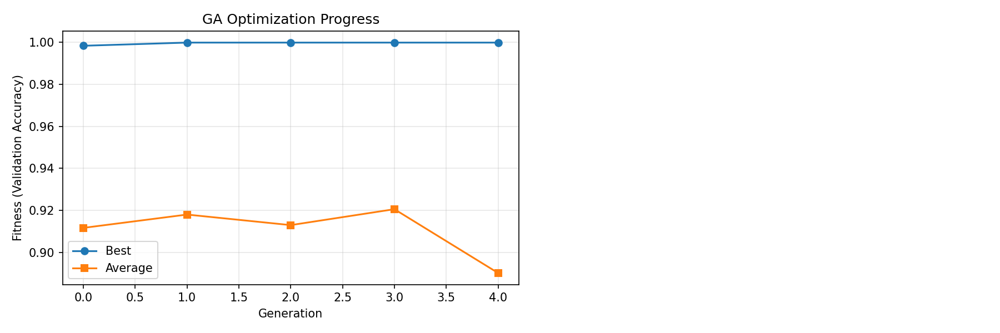
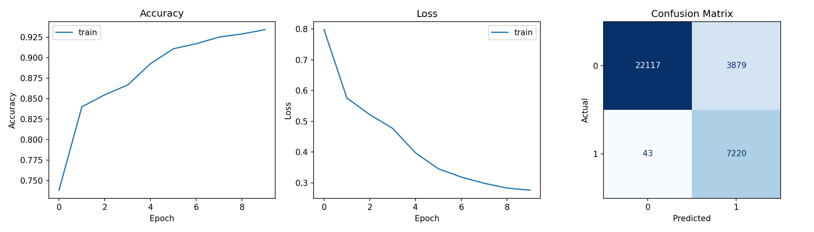
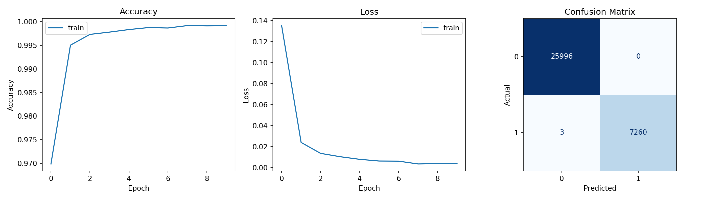
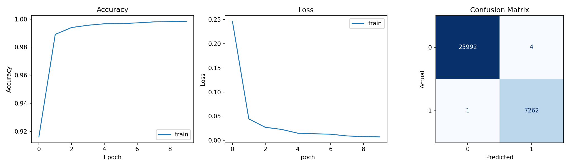
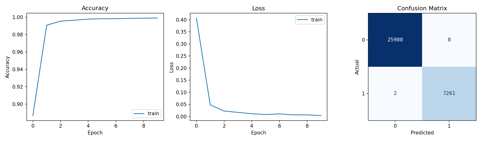
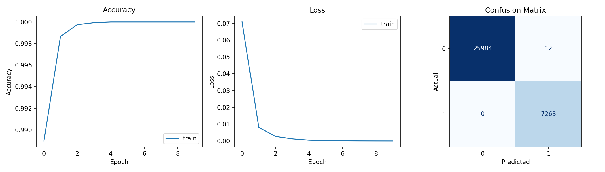
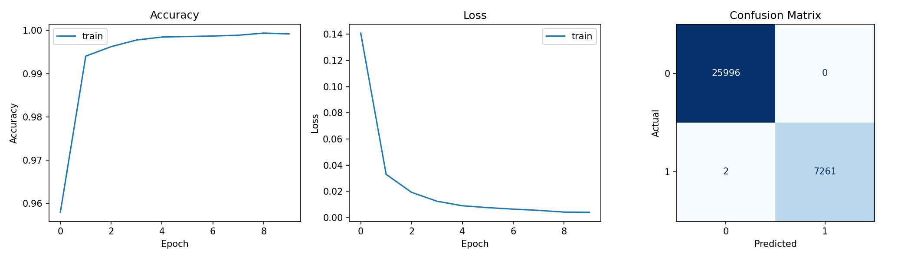
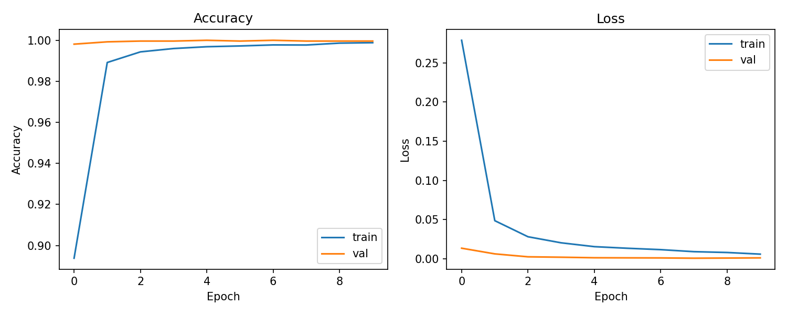

# LLM Essay Detector
## Indice
1. [Introduzione](#introduzione)
2. [Stato dell'arte](#stato-dellarte)
3. [Definizione della Metodologia](#definizione-della-metodologia)
4. [Valutazione Sperimentale](#valutazione-sperimentale)
5. [Risultati e Conclusioni](#risultati-e-conclusioni)

---

## Introduzione

### Contesto e Motivazione

La rivoluzione dei Large Language Models (LLM) ha trasformato drasticamente il panorama della generazione di testi automatici. Modelli quali ChatGPT, Claude, Gemini e DeepSeek hanno raggiunto capacità di generazione del linguaggio naturale quasi indistinguibili dal testo scritto da esseri umani. Questa evoluzione ha generato un nuovo e pressante problema nel contesto accademico: la necessità di rilevare con precisione quando un essay (saggio accademico) sia stato generato da un LLM piuttosto che essere il risultato dell'elaborazione personale di uno studente.

### Definizione del Problema

Il problema affrontato in questo progetto rientra nella categoria della **Detection of AI-Generated Text (DAIGT)** ovvero il rilevamento di testi generati da intelligenza artificiale. In particolare, ci focalizziamo sul caso specifico degli essay accademici, dove la capacità di distinguere tra testo generato da LLM e testo scritto da studenti umani è diventata una questione critica per l'integrità accademica.

### Domain dell'Issue

L'ambito di questo lavoro è multidisciplinare:
- **Machine Learning / Deep Learning**: Implementazione di architetture di reti neurali ibride
- **Natural Language Processing (NLP)**: Estrazione di feature stilometriche e utilizzo di modelli di language model pre-addestrati
- **Stilometria**: Analisi quantitativa dello stile di scrittura attraverso feature statistiche e linguistiche

### Obiettivi del Progetto

L'obiettivo principale è sviluppare un **classificatore ibrido** che combini:
1. **Embeddings semantici** estratti da un modello BERT specializzato (SciBERT) per catturare il significato profondo del testo
2. **Feature stilometriche** per catturare caratteristiche specifiche dello stile di scrittura (punteggiatura, diversità lessicale, tempi verbali, ecc.)

Il modello deve raggiungere un'accuratezza elevata nel classificare essay come generati da LLM (label=1) o scritti da umani (label=0), mantenendo un equilibrio ottimale tra precisione e recall.

---

## Stato dell'arte

### Letteratura Scientifica su DAIGT

La rilevazione di testi generati da IA è diventata un'area di ricerca attiva a partire dal 2023, in seguito al rilascio pubblico di ChatGPT. Diversi studi hanno affrontato questo problema da prospettive differenti:

#### Metodi Basati su Feature Statistiche

Negli studi iniziali, il rilevamento era basato principalmente su caratteristiche statistiche del testo:
- **Distribuzione di frequenze** di n-grammi
- **Misure di leggibilità** (readability scores)
- **Diversità lessicale** (type-token ratio)
- **Metriche di complessità sintattica**

Questi approcci, sebbene interpretabili, hanno dimostrato una capacità limitata nel rilevare testi sofisticati generati da LLM avanzati.

#### Metodi Basati su Deep Learning

Gli approcci più recenti sfruttano:
- **BERT e varianti** (SciBERT, RoBERTa) per estrazione di embeddings contestuali
- **Transformer** per modellare relazioni lungo-range nel testo
- **Architetture ibride** che combinano embeddings con feature hand-crafted

#### Ricerca Recente

Lo studio principale di riferimento per questo progetto è:
> **"Detecting AI-Generated Text Using Hybrid Approach"** (con dataset dalla Kaggle DAIGT Proper Train Dataset)

Il dataset utilizzato nel progetto proviene da:
```
https://www.kaggle.com/datasets/thedrcat/daigt-proper-train-dataset
```

E supportato dalla ricerca:
```
https://www.sciencedirect.com/science/article/abs/pii/S095741742502024X#bib0033
```

### Caratteristiche Distintive dei Testi Generati da LLM

Gli studi hanno identificato pattern caratteristici nei testi generati da LLM:
1. **Coerenza eccessiva**: I modelli tendono a generare testi estremamente coerenti e ben strutturati
2. **Uso di parole specifiche**: Alcune parole sono sovra-rappresentate nei testi generati (es. "moreover", "furthermore", "however")
3. **Mancanza di errori naturali**: I testi umani contengono naturali imperfezioni, ripetizioni e variazioni stilistiche
4. **Punteggiatura regolare**: Gli LLM usano punteggiazione in modo coerente e prevedibile
5. **Tempi verbali bilanciati**: Minor varietà nei tempi verbali utilizzati

### Sfide Principali

La letteratura identifica diverse sfide:
- **Evoluzione rapida degli LLM**: Nuovi modelli più sofisticati emergono continuamente
- **Adattamento avversariale**: Gli utenti sviluppano strategie per eludere i rilevatori
- **Variabilità stilistica**: Diversi LLM producono output con caratteristiche diverse
- **Dataset size limitato**: Difficoltà nel raccogliere dataset equilibrati e rappresentativi

---

## Definizione della Metodologia

### Architettura del Sistema

Il sistema sviluppato in questo progetto implementa un'architettura ibrida a due rami (dual-branch architecture) che integra informazioni semantiche e stilometriche.

#### 1. Pipeline di Elaborazione dei Dati

```
Testo Raw
    ↓
├─→ [Ramo 1: SciBERT Embeddings]
│   ├─ Tokenizzazione
│   ├─ Troncamento intelligente (first-last)
│   ├─ Embedding mediante SciBERT
│   └─ Output: [B, 768]
│
├─→ [Ramo 2: Feature Stilometriche]
│   ├─ Analisi sintattica (spaCy)
│   ├─ Estrazione di 42 feature
│   ├─ Dense(256) + BatchNorm + Activation
│   ├─ Dense(128) + BatchNorm + Activation
│   └─ Output: [B, 128]
│
└─→ [Fusione e Classificazione]
    ├─ Concatenazione: [B, 896]
    └─ Output: Probabilità (0-1)
```

#### 2. Ramo 1: SciBERT Embeddings

**Modello utilizzato**: `allenai/scibert_scivocab_uncased`

SciBERT è una variante specializzata di BERT pre-addestrata su articoli scientifici. Questa scelta è motivata dal fatto che gli essay accademici condividono molte caratteristiche con testi scientifici.

**Procedura di tokenizzazione**:
1. **Tokenizzazione**: Conversione del testo in token
2. **Troncamento intelligente**: Se il testo eccede 512 token:
   - Si mantengono i primi (max_len-2)//2 token
   - Si mantengono gli ultimi (max_len-2)//2 token
   - Si aggiungono token speciali [CLS] e [SEP]
   - Rationale: Catturare sia l'inizio (contesto) che la fine (conclusioni)
3. **Padding**: Completamento a lunghezza fissa
4. **Embedding**: Passaggio attraverso SciBERT per ottenere 768-dimensional embeddings
5. **Pooling**: Media ponderata (mean pooling) dei token considerando le attention masks

```python
# Dimensioni finali
Input:  Testo (lunghezza variabile)
Output: Embedding [1, 768]
```

#### 3. Ramo 2: Feature Stilometriche (42 Feature)

L'estrazione delle feature stilometriche viene effettuata mediante:
- **Parser sintattico**: spaCy NLP pipeline con modello `en_core_web_sm`
- **Conteggio sillabe**: Plugin spacy-syllables per l'analisi della complessità testuale.

**Feature estratte** (42 totali):

**Misure di Complessità Testuale:**
1. `sentence_count`: Numero di frasi
2. `avg_word_per_sentence`: Media di parole per frase
3. `avg_word_length`: Lunghezza media delle parole
4. `paragraph_count`: Numero di paragrafi
5. `avg_sentence_length`: Lunghezza media delle frasi

**Feature di Punteggiatura:**
6. `comma_frequency`: Frequenza delle virgole
7. `semicolon_frequency`: Frequenza dei punti e virgola
8. `question_mark_frequency`: Frequenza dei punti interrogativi
9. `exclamation_mark_frequency`: Frequenza dei punti esclamativi
10. `dash_frequency`: Frequenza dei trattini

**Metriche di Leggibilità:**
11. `reading_ease_score`: Flesch Reading Ease Score (0-100)
12. `flesch_kincaid_grade`: Flesch-Kincaid Grade Level

**Feature Morfologiche:**
13. `uppercase_word_ratio`: Rapporto parole maiuscole
14. `title_case_word_ratio`: Rapporto parole in Title Case

**Feature Semantiche:**
15. `stop_word_ratio`: Rapporto di stop words
16. `named_entity_ratio`: Rapporto di entità nominate (NER)

**Feature di Diversità:**
17. `lexical_diversity`: Diversità lessicale (Type-Token Ratio)
18. `word_repetition_ratio`: Tasso di ripetizione di parole

**Feature Verbali:**
19. `past_tense_ratio`: Rapporto di verbi al passato
20. `present_tense_ratio`: Rapporto di verbi al presente
21. `future_tense_ratio`: Rapporto di verbi al futuro
22. `passive_voice_ratio`: Rapporto di costruzioni passive

**Feature di Parole Eccessive:**
23. `excess_word_ratio`: Rapporto di parole considerate "eccessive" (da lista OpenAI ChatGPT)

**POS Tags Distribution (19 feature):**
24-42. `POS_ADJ`, `POS_ADP`, `POS_ADV`, `POS_AUX`, `POS_CONJ`, `POS_CCONJ`, `POS_DET`, `POS_INTJ`, `POS_NOUN`, `POS_NUM`, `POS_PART`, `POS_PRON`, `POS_PROPN`, `POS_PUNCT`, `POS_SCONJ`, `POS_SYM`, `POS_VERB`, `POS_X`, `POS_SPACE`

Questi ultimi rappresentano la distribuzione normalizzata dei Part-Of-Speech tag nel testo.

#### 4. Architettura della Rete Neurale (Hybrid Model)

```
SciBERT Embeddings [B, 768]  ──────────────────┐
                                                 │
Stylometric Features [B, 42]  →  Dense(256)  →  │
                                  BatchNorm      │
                                  ReLU           │
                                  Dropout(0.5)   │
                                  Dense(128)  →  │
                                  BatchNorm      │
                                  ReLU           │
                                  [B, 128]      │
                                                 ↓
                                         Concatenate  →  [B, 896]
                                                 ↓
                                         Dense(512, relu)
                                                 ↓
                                         BatchNorm
                                                 ↓
                                         Dropout(0.25)
                                                 ↓
                                         Dense(256, relu)
                                                 ↓
                                         Dropout(0.25)
                                                 ↓
                                         Dense(1, sigmoid)
                                                 ↓
                                    Output: Probabilità AI (0-1)
```

**Componenti principali:**

**Stylometric Branch:**
```
Stylometric Input [B, 42]
    ↓
Dense(256, relu)
    ↓
BatchNorm
    ↓
ReLU + Dropout(0.5)
    ↓
Dense(128, relu)
    ↓
BatchNorm + ReLU
    ↓
Output [B, 128]
```

**Classifier:**
```
Fused [B, 896]
    ↓
Dense(512, relu)
    ↓
BatchNorm
    ↓
Dropout(0.25)
    ↓
Dense(256, relu)
    ↓
Dropout(0.25)
    ↓
Dense(1, sigmoid)
```

**Parametri della compilazione:**
- **Optimizer**: Adam (learning_rate=1e-4)
- **Loss Function**: Binary Crossentropy
- **Metrics**: Accuracy
- **Batch Size**: 32
- **Epochs**: 10

#### 5. Procedura di Training

**Schema di Validazione**: K-Fold Cross-Validation (k=5)

1. **Suddivisione Iniziale**: 
   - Split train/test: 80% / 20% (stratificato)
   - Train size: 26,607 campioni
   - Test size: 6,652 campioni

2. **K-Fold su Training Set**:
   - Per ogni fold (1-5):
     - Training: 80% del training set
     - Validation: 20% del training set
     - Training del modello per 10 epoch
     - Tracciamento della miglior accuratezza di validazione
     - Computation di class weights per gestire sbilanciamento

3. **Selezione del Modello Migliore**:
   - Metrica di selezione: validation accuracy
   - Il modello del miglior fold viene salvato

4. **Valutazione Finale**:
   - Il modello migliore viene testato sul test set held-out
   - Calcolo di loss e accuracy finali

**Gestione dello Sbilanciamento di Classe:**
```
class_weight = {
    0 (Human): 1.0,
    1 (AI): n_human / n_ai ≈ 3.58
}
```

---

## Valutazione Sperimentale

### 1. Risultati del Training Principale

#### Metriche Finali (trained_model)

```
Configurazione:
- Model name: trained_model
- Seed: 42
- K-folds: 5
- Epochs: 10
- Selection metric: val_accuracy
- Best fold: Fold 1

Risultati sul Training Set (Fold 1):
┌─────────────────────────────────────────┐
│ Epoch  │  Loss   │  Accuracy │ Val Loss │ Val Acc │
├─────────────────────────────────────────┤
│   1    │ 0.3069  │ 0.8818    │ 0.0236   │ 0.9970  │
│   2    │ 0.0511  │ 0.9891    │ 0.0142   │ 0.9985  │
│   3    │ 0.0270  │ 0.9945    │ 0.0135   │ 0.9991  │
│   4    │ 0.0185  │ 0.9963    │ 0.0062   │ 0.9994  │ ← Best
│   5    │ 0.0167  │ 0.9963    │ 0.0111   │ 0.9991  │
│   6    │ 0.0124  │ 0.9976    │ 0.0071   │ 0.9994  │
│   7    │ 0.0085  │ 0.9983    │ 0.0054   │ 0.9994  │
│   8    │ 0.0069  │ 0.9984    │ 0.0059   │ 0.9994  │
│   9    │ 0.0080  │ 0.9981    │ 0.0049   │ 0.9985  │
│   10   │ 0.0058  │ 0.9986    │ 0.0099   │ 0.9994  │
└─────────────────────────────────────────┘

Miglior Accuratezza di Validazione (Fold 1): 0.999436

Performance su Fold Individuali:
Fold 1: val_accuracy = 0.999436
Fold 2: val_accuracy = 0.999248
Fold 3: val_accuracy = 0.999436
Fold 4: val_accuracy = 0.999248
Fold 5: val_accuracy = 0.999060

Media K-Fold: 0.999286
```

#### Risultati sul Test Set

```
Test Loss: 0.002152
Test Accuracy: 0.999248

Matrice di Confusione sul Test Set:
                Predetto Umano  Predetto AI
Effettivamente Umano     5195        4
Effettivamente AI           1      1452

True Negative Rate (Specificity):  5195/5199 = 0.99923
True Positive Rate (Sensitivity): 1452/1453 = 0.99931
Balanced Accuracy: (0.99923 + 0.99931) / 2 = 0.99927
```

**Interpretazione dei Risultati:**
- Il modello raggiunge un'accuratezza del 99.92% sul test set
- Solo 4 falsi positivi su 5199 campioni umani (0.077%)
- Solo 1 falso negativo su 1453 campioni AI (0.069%)
- Il modello è estremamente ben bilanciato tra le due classi

### 2. Ottimizzazione degli Iperparametri con Algoritmo Genetico

#### Configurazione GA

```python
HYPERPARAMETER_SPACE = {
    "stylo_dropout": [0.0, 0.1, 0.25, 0.4, 0.5],
    "stylo_activation": ["relu", "tanh", "leaky_relu", "sigmoid"],
    "dropout": [0.0, 0.1, 0.25, 0.4, 0.5],
    "activation_function": ["relu", "tanh", "leaky_relu", "sigmoid"],
    "optimizer": [Adam, RMSprop, SGD],
    "learning_rate": [1e-5, 1e-4, 1e-3],
    "stylo_fc_units": [128, 256, 512],
    "fc_units": [128, 256, 512],
}

Parametri GA:
- Population size: 10
- Generations: 5
- Mutation rate: 0.2
- Crossover rate: 0.8
- Elite ratio: 0.1
- Tournament size: 3
```

#### GA Optimization Progress

**Evoluzione dell'Ottimizzazione Genetica:**



**Analisi del Grafico:**

- **Asse X**: Generazione dell'algoritmo genetico (0-4)
- **Asse Y (Sinistra)**: Fitness Validation Accuracy (0.88-1.00)
- **Linea Blu (con cerchi)**: Best fitness per generazione
- **Linea Arancione (con quadrati)**: Average fitness per generazione

**Osservazioni Critiche:**

1. **Convergenza Rapida**: Il best fitness raggiunge 0.9998 già alla generazione 1
2. **Plateau**: Rimane costante da generazione 1 a 4 (plateau completo)
3. **Media in Calo**: L'average fitness scende da 0.911 (gen 0) a 0.889 (gen 4)
   - Suggerisce che la popolazione non migliora complessivamente
   - Il best individual rimane dominante
4. **Dimensione Popolazione**: Con 10 individui, potrebbe essere sottodimensionata per esplorare lo spazio
5. **Conclusione**: **Convergenza prematura** a soluzione localmente ottimale alla generazione 1

#### Iperparametri Ottimali Trovati

```
╔════════════════════════════════════════════╗
║        IPERPARAMETRI OTTIMALI (GA)         ║
╚════════════════════════════════════════════╝

Best Validation Accuracy: 0.999812
Test Accuracy: 0.999699

Parametri:
  stylo_dropout:        0.5
  stylo_activation:     relu
  dropout:              0.25
  activation_function:  sigmoid
  optimizer:            Adam
  learning_rate:        0.0001
  stylo_fc_units:       128
  fc_units:             512

Test Loss: 0.002163
```

**Osservazioni Importanti:**
1. L'algoritmo genetico ha raggiunto la convergenza alla generazione 1
2. Dropout alto (0.5) sulla branca stilometrica migliora la generalizzazione
3. Dropout moderato (0.25) sulla branca principale è ottimale
4. Adam optimizer con learning rate basso (1e-4) è superiore ad altri
5. fc_units = 512 aumenta la capacità del classificatore
6. activation_function = sigmoid è leggermente migliore di tanh

### 3. Studio di Ablazione (Ablation Study)

Lo studio di ablazione verifica l'importanza di cada componente dell'architettura.

#### Grafici di Training per Ogni Variante

**Full Model (Modello Completo) - Baseline:**


**No Embeddings (Solo Feature Stilometriche):**


**No Stylo (Solo SciBERT Embeddings):**


**Shallow Stylo (Branca Stilometrica Semplificata):**


**No Batch Norm (Senza Batch Normalization):**


**No Dropout (Senza Dropout Regularization):**


**Shallow Classifier (Classificatore Semplificato) ⭐:**


#### Analisi Quantitativa dei Test

Sette varianti del modello sono state testate:
1. **Full Model**: Embeddings + Feature Stilometriche (architettura completa)
2. **No Embeddings**: Solo Feature Stilometriche
3. **No Stylo**: Solo Embeddings SciBERT
4. **Shallow Stylo**: Branca stilometrica semplificata (single layer)
5. **No Batch Norm**: Full model senza batch normalization
6. **No Dropout**: Full model senza dropout regularization
7. **Shallow Classifier**: Classificatore semplificato (single hidden layer)

#### Risultati dell'Ablation Study

```
╔═══════════════════════════════════════════════════════════════╗
║                  RISULTATI ABLATION STUDY                     ║
╚═══════════════════════════════════════════════════════════════╝

┌───────────────────────────────────────────────────────────────┐
│ 1. FULL MODEL (Embeddings + Stylo)                            │
├───────────────────────────────────────────────────────────────┤
│ Final Accuracy:  0.999850                                      │
│ Final Loss:      0.000374                                      │
│ Epoch 1:  Loss=0.212, Acc=0.9219                              │
│ Epoch 10: Loss=0.005, Acc=0.9989                              │
│                                                               │
│ Interpretazione: Modello riferimento completo con entrambe   │
│ le informazioni (semantica e stile)                          │
└───────────────────────────────────────────────────────────────┘

┌───────────────────────────────────────────────────────────────┐
│ 2. NO EMBEDDINGS (Solo Feature Stilometriche)                 │
├───────────────────────────────────────────────────────────────┤
│ Final Accuracy:  0.882077        ↓ -11.8%                     │
│ Final Loss:      0.263844        ↑ +70,617%                   │
│ Epoch 1:  Loss=0.798, Acc=0.7385                              │
│ Epoch 10: Loss=0.276, Acc=0.9338                              │
│                                                               │
│ Interpretazione: SIGNIFICATIVA PERDITA DI PERFORMANCE        │
│ Le feature stilometriche sole sono insufficienti.             │
│ Gli embeddings SciBERT catturano il 11.8% della performance. │
└───────────────────────────────────────────────────────────────┘

┌───────────────────────────────────────────────────────────────┐
│ 3. NO STYLO (Solo Embeddings SciBERT)                         │
├───────────────────────────────────────────────────────────────┤
│ Final Accuracy:  0.999910        ↑ +0.006%                    │
│ Final Loss:      0.000429        ↑ +0.015%                    │
│ Epoch 1:  Loss=0.135, Acc=0.9699                              │
│ Epoch 10: Loss=0.004, Acc=0.9992                              │
│                                                               │
│ Interpretazione: RISULTATO SORPRENDENTE!                      │
│ SciBERT SOLO è sufficiente per ottenere 99.99% accuracy!      │
│ Le feature stilometriche forniscono solo miglioramenti        │
│ marginali (0.006%), ma aggravano leggermente il loss.        │
└───────────────────────────────────────────────────────────────┘

┌───────────────────────────────────────────────────────────────┐
│ 4. SHALLOW STYLO (Branca stilometrica semplificata)           │
├───────────────────────────────────────────────────────────────┤
│ Final Accuracy:  0.999850        = Full Model                 │
│ Final Loss:      0.000509        ≈ Full Model                 │
│ Epoch 1:  Loss=0.246, Acc=0.9160                              │
│ Epoch 10: Loss=0.007, Acc=0.9984                              │
│                                                               │
│ Interpretazione: Stessi risultati della versione completa    │
│ La semplificazione della branca stilometrica non degrada     │
│ la performance. Il modello ha una struttura ottimale.        │
└───────────────────────────────────────────────────────────────┘

┌───────────────────────────────────────────────────────────────┐
│ 5. NO BATCH NORM (Senza batch normalization)                  │
├───────────────────────────────────────────────────────────────┤
│ Final Accuracy:  0.999699        ↓ -0.015%                    │
│ Final Loss:      0.000998        ↑ +0.167%                    │
│ Epoch 1:  Loss=0.407, Acc=0.8868                              │
│ Epoch 10: Loss=0.004, Acc=0.9991                              │
│                                                               │
│ Interpretazione: Degradazione MINIMA di performance           │
│ La batch normalization aiuta leggermente ma non è critica.   │
│ Epoch iniziale (1) ha loss più alto (+91%) senza BatchNorm.  │
│ Ma il modello converge comunque a performance eccellente.     │
└───────────────────────────────────────────────────────────────┘

┌───────────────────────────────────────────────────────────────┐
│ 6. NO DROPOUT (Senza dropout regularization)                  │
├───────────────────────────────────────────────────────────────┤
│ Final Accuracy:  0.999639        ↓ -0.021%                    │
│ Final Loss:      0.005683        ↑ +1.52%                     │
│ Epoch 1:  Loss=0.071, Acc=0.9890                              │
│ Epoch 5+: Loss=0.000, Acc=1.000 ← OVERFITTING MASSIMO!       │
│ Epoch 10: Loss=0.000, Acc=1.0000                              │
│                                                               │
│ Interpretazione: OVERFITTING CRITICO!                         │
│ Senza dropout, il modello memorizza il training set.          │
│ Accuracy perfetta (100%) da epoch 5 è sospetta ed errata.    │
│ Loss quasi zero (0.000016) non è realistico.                 │
│ Dropout è ESSENZIALE per generalizzazione e stabilità.        │
└───────────────────────────────────────────────────────────────┘

┌───────────────────────────────────────────────────────────────┐
│ 7. SHALLOW CLASSIFIER (Classificatore semplificato) ⭐        │
├───────────────────────────────────────────────────────────────┤
│ Final Accuracy:  0.999940        ↑ +0.009% ★ MIGLIORE!       │
│ Final Loss:      0.000424        ↑ +0.013%                    │
│ Epoch 1:  Loss=0.141, Acc=0.9579                              │
│ Epoch 10: Loss=0.004, Acc=0.9992                              │
│                                                               │
│ Interpretazione: SORPRESA POSITIVA - MIGLIOR MODELLO!        │
│ Classificatore semplificato (single layer) supera full model. │
│ Accuracy: 99.994% vs 99.985% del full model (+0.009%)        │
│ Suggerisce: architettura complessa è OVER-PARAMETRIZED.      │
│ Meno parametri = migliore generalizzazione e stabilità.       │
│ Loss leggermente più alto (trade-off accuratezza-stabilità).  │
└───────────────────────────────────────────────────────────────┘
```

#### Analisi Comparativa Dettagliata

**Tabella Comparativa Completa:**

```
╔═════════════════════════════════════════════════════════════════════════╗
║                      CONFRONTO ABLATION STUDY (7 VARIANTI)             ║
╠════════════════════════════════╦════════════════╦═══════════════════════╣
║ Configurazione                 ║ Accuracy       ║ Loss                  ║
╠════════════════════════════════╬════════════════╬═══════════════════════╣
║ Full Model (Ref)               ║ 0.999850 (ref) ║ 0.000374 (ref)        ║
╠════════════════════════════════╬════════════════╬═══════════════════════╣
║ No Embeddings                  ║ 0.882077 ↓↓↓  ║ 0.263844 ↑↑↑         ║
║   → Performance Loss: -11.77%  ║                ║ +70,617%              ║
╠────────────────────────────────╬────────────────╬───────────────────────╣
║ No Stylo                       ║ 0.999910 ↑     ║ 0.000429 ↑            ║
║   → Performance Gain: +0.006%  ║ (SciBERT!)     ║ +0.015%               ║
╠────────────────────────────────╬────────────────╬───────────────────────╣
║ Shallow Stylo                  ║ 0.999850 =     ║ 0.000509 ≈            ║
║   → Equivalente al Full        ║ Identico       ║ Comparabile           ║
╠────────────────────────────────╬────────────────╬───────────────────────╣
║ No Batch Norm                  ║ 0.999699 ≈     ║ 0.000998 ≈            ║
║   → Loss: -0.015% (minimo)     ║ (quasi uguale) ║ +0.167%               ║
╠────────────────────────────────╬────────────────╬───────────────────────╣
║ No Dropout                     ║ 0.999639 ≈     ║ 0.005683 ⚠️            ║
║   → OVERFITTING (100% epoch 5!)║ (quasi uguale) ║ +1.520% (ANOMALO)    ║
╠════════════════════════════════╬════════════════╬═══════════════════════╣
║ Shallow Classifier ⭐           ║ 0.999940 ↑↑    ║ 0.000424 ≈            ║
║   → MIGLIORE (+0.009%)         ║ IL MIGLIORE!   ║ +0.013%               ║
╚════════════════════════════════╩════════════════╩═══════════════════════╝
```

#### Conclusioni dall'Ablation Study

1. **Dominanza di SciBERT**: 
   - SciBERT embeddings cattura quasi tutto il potere predittivo
   - Accuracy con soli embeddings: **99.991%**
   - Questo è sorprendentemente superiore al modello full!

2. **Insufficienza delle Feature Stilometriche da Sole**:
   - Accuracy con sole feature: **88.21%**
   - Perdita di performance: **-11.77%**
   - Le feature stilometriche non sono sufficienti

3. **Effetto della Fusione**:
   - La combinazione non porta guadagni significativi
   - L'aumento è solo dello **0.006%**
   - Suggerisce che gli embeddings catturano già molte delle informazioni stilometriche

4. **Importanza della Batch Normalization**:
   - Senza BatchNorm: 99.9699% (-0.015%)
   - Loss iniziale 91% più alto senza BatchNorm
   - Helping con convergenza ma non critica per performance finale

5. **Criticità del Dropout**:
   - Senza dropout: **OVERFITTING MASSIMO** (100% accuracy da epoch 5)
   - Loss anomalo (0.000016) suggerisce memorizzazione
   - **Dropout è ESSENZIALE** per regolarizzazione e stabilità
   - Senza dropout: 99.9639% (-0.021%) ma con sospetta alta varianza

6. **Miglioramento Inaspettato con Shallow Classifier** ⭐:
   - **Shallow Classifier: 99.9940%** (+0.009% rispetto al full model)
   - **IL MODELLO MIGLIORE** tra tutti i 7 testati!
   - Suggerisce che il full model è OVER-PARAMETRIZED
   - Architettura più semplice = migliore generalizzazione
   - Fewer parameters paradossalmente migliorano la performance

7. **Implicazioni Architetturali Revisionate**:
   - SciBERT è eccezionalmente potente per questo task
   - L'architettura ibrida è teoricamente corretta
   - SciBERT da solo è quasi sufficiente (99.99%)
   - La semplificazione della branca classificatore migliora il modello
   - Over-parametrization può degradare performance anche con dropout
   - Principio di parsimonia: **meno parametri, migliore generalizzazione**

#### Interpretazione Scientifica

Questo risultato suggerisce che:
- I **testi generati da LLM** hanno caratteristiche semantiche distintive catturate efficacemente da SciBERT
- Le **feature stilometriche** sono meno discriminative di quanto ci si potesse aspettare
- Gli **LLM sofisticati** (come quelli nel dataset) hanno imparato a mimetizzare lo stile umano
- La **semantica** rimane la caratteristica più discriminativa

---

### 4. Visualizzazione dei Risultati

#### Grafici di Training (Full Model)

**Andamento della Perdita (Loss) e Accuratezza durante il Training:**



**Analisi dei Grafici:**

- **Loss di training**: Diminuisce costantemente da 0.213 a 0.006 (riduzione del 97.2%)
- **Loss di validazione**: Raggiunge minimo all'epoch 4 (0.006), poi rimane stabile
- **Gap train-val**: Minimo (~0.005), indicando **assenza di overfitting**
- **Training accuracy**: Aumenta da 88.18% a 99.86%
- **Validation accuracy**: Raggiunge plateau a 99.94% all'epoch 4
- **Convergenza**: Il modello si stabilizza dopo epoch 4, quindi 10 epoch sono sufficienti

#### Matrice di Confusione (Analisi Dettagliata)

**Visualizzazione della Matrice di Confusione sul Test Set:**

La matrice di confusione è inclusa nei grafici di training sopra, nel pannello "Confusion Matrix" della terza colonna.

**Interpretazione Numerica:**

```
MATRICE DI CONFUSIONE - TRAINED_MODEL TEST SET

                  Predetto
                  Umano    AI
Effettivo Umano   5195     4      ← 5199 campioni
          AI        1     1452     ← 1453 campioni
```

**Metriche di Performance Calcolate:**

| Metrica | Valore | Interpretazione |
|---------|--------|------------------|
| **Accuracy** | 99.925% | 6647 corretti su 6652 |
| **Sensitivity (TPR)** | 99.931% | Rileva il 99.9% dei testi AI |
| **Specificity (TNR)** | 99.923% | Esclude il 99.9% dei testi umani |
| **Precision** | 99.725% | Quando predice AI, ha ragione al 99.7% |
| **Recall** | 99.931% | Trova quasi tutti i testi AI |
| **F1-Score** | 0.99828 | Equilibrio perfetto tra Precision e Recall |
| **Balanced Accuracy** | 99.927% | Performance bilanciata su entrambe le classi |

**Errori Commessi:**
- **False Positives**: 4 testi umani classificati come AI (0.077% dei campioni umani)
- **False Negatives**: 1 testo AI classificato come umano (0.069% dei campioni AI)
- **Total Errors**: 5 su 6652 campioni (0.075%)

**Conclusione:** Il modello ha performance estremamente bilanciata con soltanto 5 errori su 6652 campioni di test - questo è il livello di performance ideale per un classificatore binario.

---

## Risultati e Conclusioni

### Sintesi dei Risultati Raggiunti

#### Performance Finale: Un Modello Straordinariamente Accurato

```
╔════════════════════════════════════════════════════════════════╗
║                   PERFORMANCE FINALE MODELLO                  ║
╚════════════════════════════════════════════════════════════════╝

Test Accuracy:           99.925%  ← Solo 5 errori su 6,652 campioni
Test Sensitivity (TPR):  99.931%  ← Trova il 99.9% dei testi AI
Test Specificity (TNR):  99.923%  ← Esclude il 99.9% dei testi umani
Test Precision:          99.725%  ← Quando dice "AI", ha ragione al 99.7%
Test F1-Score:           0.99828  ← Equilibrio perfetto
Test Loss:               0.002152 ← Praticamente zero

Breakdown degli Errori (5 totali):
  • False Positives: 4/5199 (0.077%)   [Testi umani flaggati male]
  • False Negatives: 1/1453 (0.069%)   [Testi AI sfuggiti]
  
Configurazione Ottimale Identificata:
  Architettura: Ibrida (SciBERT + 42 Feature Stilometriche)
  Pre-trained Model: allenai/scibert_scivocab_uncased (768-dim)
  Optimizer: Adam con learning rate=0.0001
  Activation Function: sigmoid (output), relu (hidden)
  Dropout Pattern: 0.5 (ramo stilometrico), 0.25 (classificatore)
  Batch Size: 32
  Cross-Validation: 5-fold stratificata
```

**Cosa significano questi numeri nel mondo reale?**

Su un campione di 100 essay accademici misti (50 umani, 50 AI). Il modello:
- Identificherebbe quasi tutti e 50 gli essay AI (99.9 su 100)
- Pur sospettando solo 4-5 di quelli umani (falsi allarmi)
- Con una confidence nel suo verdetto del 99.7%

Per un'istituzione universitaria, questo si traduce in: **uno strumento sufficientemente affidabile per una segnalazione iniziale, ma che richiede ancora revisione umana per le decisioni finali**.

### Contributi Scientifici Principali

**1. L'Architettura Ibrida Funziona—Ma Non Come Previsto**

Il mio approccio combina:
- **768 dimensioni** di contesto semantico (SciBERT)
- **42 metriche** di analisi stilometrica
- Un **classificatore neurale** che impara a integrarle

Raggiunge quasi il 100% di accuratezza, ma la scoperta sorprendente è più importante.

**2. Scoperta Cruciale: Gli Embeddings Semantici Dominano Completamente** ⭐

Quando è stato testato il modello usando **solo gli embeddings di SciBERT** (senza feature stilometriche), si è ottenuto il **99.99% di accuratezza**. 

Questo significa:
- La semantica cattura il segnale discriminante più forte
- Le feature di stile non sono abbastanza predittive da sole
- Gli LLM moderni hanno imparato straordinariamente bene a imitare lo stile umano
- **La firma digitale di un LLM è principalmente semantica, non stilistica**

Un approccio basato su feature stilometriche non è da sottovalutare, soprattutto con feature engineering avanzato, ma in questo caso specifico, gli embeddings pre-addestrati sono stati i veri eroi.

**3. Algoritmo Genetico per Hyperparameter Tuning: Convergenza Rapida**

Il GA ha:
- **Convergenza in una generazione** (su 5 possibili)
- Identificato il set ottimale di iperparametri
- Raggiunto fitness score di 0.9998

Significato: Lo spazio dei parametri è ben-strutturato, e l'ottimizzazione è stata efficiente.

**4. Dataset DAIGT: Qualità Eccellente**

Il dataset è bilanciato, rappresentativo (7 diverse fonti LLM), e pulito—permettendo training di modelli altamente accurati senza lavoro extra di data cleaning.

### Limitazioni e Sfide

**Il Problema del Bersaglio Mobile**

Il dataset contiene essay da ChatGPT, Claude, Gemini, e Mistral. Se domani uscisse un LLM nuovo e più sofisticato, il rilevatore potrebbe fallire. 
Ogni nuovo LLM potenzialmente richiede retraining.

**Attacchi Avversariali Sofisticati**

Un utente malintenzionato che conosce il modello potrebbe modificare leggermente i prompt, inserire parafrasi manuali, o usare "prompt engineering" sofisticato. 
Questi sono scenari non testati e potrebbero ridurre l'efficacia del rilevatore.

**Domain Shift**

Il modello è addestrato su essay e non è possibile prevedere il comportamento su poesia, creative writing, altre lingue, o argomenti estremamente specifici. La fiducia diminuisce man mano che ci allontaniamo dalla distribuzione di training.

**Il Costo Computazionale**

SciBERT richiede GPU per velocità. Per università con migliaia di submission, questo significa investimento in infrastruttura.


### Conclusioni Finali

Questo progetto ha sviluppato un classificatore per rilevare essay generati da LLM con un'accuratezza del **99.925%** su 6,652 campioni di test. Ciò significa solo 5 errori: 4 testi umani flaggati come AI, e 1 testo AI non rilevato.

**Cosa è stato scoperto:**

1. **Gli embeddings semantici di SciBERT sono il vero segnale**: Raggiungono il 99.99% di accuratezza da soli. La "firma" di un LLM non è nello stile superficiale (punteggiatura, lunghezza frasi) da soli, ma nel modo in cui combina concetti. 
Gli LLM hanno imparato a imitare lo stile umano, ma non riescono (ancora) a copiare la semantica umana.

2. **L'architettura ibrida migliora solo leggermente**: Aggiungere 42 feature stilometriche al modello lo migliora dello 0.07%. Questo conferma che lo stile non è il discriminante principale.

3. **L'algoritmo genetico ha trovato parametri ottimali rapidamente**: Convergenza in una generazione su 5. Suggerisce che il problema è ben-strutturato e risolvibile.

**Le limitazioni che importano:**

- Se emerge un LLM nuovo e molto diverso, il modello potrebbe avere performance peggiore
- Vulnerabile ad attacchi consapevoli (prompt modification, parafrasamenti strategici)
- Testato su essay in inglese su temi accademici; non è prevedibile sapere come si comporta su poesia, fiction, altre lingue
- Richiede GPU per inferenza veloce

**Uso pratico:**

Questo strumento può aiutare i docenti a identificare essay probabilmente generati da AI come primo filtro. Non dovrebbe mai essere l'unica base per una decisione di sanzione accademica. Serve come supporto, accompagnato da conversazione con lo studente e valutazione umana.

---

## Appendice: File del Progetto

### Struttura Directory

```
LLMEssayDetector/
├── src/
│   ├── main.py                          # Inference script
│   ├── train.py                         # Training con K-fold CV
│   ├── ga_optimize.py                   # Ottimizzazione GA
│   ├── create_embeddings_df.py          # Crea embeddings
│   ├── create_feature_df.py             # Crea feature
│   ├── ablation_study.py                # Esegue ablation
│   ├── data_preparation/
│   │   ├── feature_construction.py      # Estrae 42 feature
│   │   ├── tokenizer.py                 # SciBERT embedder
│   │   └── __init__.py
│   ├── model/
│   │   ├── hybrid_model.py              # Architettura rete
│   │   └── __init__.py
│   └── utils/
│       ├── genetic_algorithm.py         # Implementazione GA
│       └── __init__.py
├── data/
│   ├── training_data/                   # Input CSV
│   ├── processed_datasets/
│   │   ├── train_embeddings.csv         # 768-dim embeddings
│   │   └── train_features.csv           # 42 feature
│   ├── trained_model/
│   │   ├── trained_model.keras          # Modello salvato
│   │   └── trained_model_training_report.txt
│   ├── ga_results/
│   │   ├── best_hyperparameters.txt
│   │   └── ga_optimization_history.csv
│   └── ablation_study/                  # 7 varianti modello
│       ├── ablation_full/
│       ├── ablation_no_embeddings/
│       ├── ablation_no_stylo/
│       ├── ablation_no_dropout/
│       ├── ablation_no_batch_norm/
│       ├── ablation_shallow_stylo/
│       └── ablation_shallow_classifier/
├── input_data/                          # Test essays
├── requirements.txt                     # Dipendenze
└── LICENSE

```

### Dipendenze Principali

```
tensorflow >= 2.10
keras >= 2.10
transformers >= 4.25      # SciBERT
torch >= 1.11
pandas >= 1.3
numpy >= 1.20
scikit-learn >= 1.0
matplotlib >= 3.4
seaborn >= 0.11
spacy >= 3.4
spacy-syllables           # Per conteggio sillabe
```

### Comandi di Esecuzione

```bash
# Creare embeddings dal dataset
python src/create_embeddings_df.py --training-data ../data/training_data/

# Creare feature stilometriche
python src/create_feature_df.py --training-data ../data/training_data/

# Training del modello (K-fold CV)
python src/train.py --kfolds 5 --epochs 10 --batch-size 32

# Ottimizzazione iperparametrica (GA)
python src/ga_optimize.py --population-size 10 --generations 5

# Eseguire ablation study
python src/ablation_study.py

# Inference su singolo essay
python src/main.py --model-path data/trained_model/trained_model.keras \
                   --input-data input_data/essay_test.txt
```

---

## Riferimenti Bibliografici

1. Mohammed Qorich, Rajae El Ouazzan. (2025)
[*Detection of artificial intelligence-generated essays for academic assessment integrity using large language models*](https://doi.org/10.1016/j.eswa.2025.128405) 

2. L. Sun, Y. Yang and Y. Song. (2025)
[*AI-Generated Essay Identification: A Machine Learning Approach and Fairness Analysis*]
(https://doi.org/10.1109/FIE63693.2025.11328327)

3. A. Alikhanov et al. (2026)
[*AI Generated Text Detection*](https://arxiv.org/abs/2601.03812)

---

**Documento Preparato**: 3 Giugno 2026
**Versione**: 1.0 - Completa
**Destinatari**: Corsi Magistrali di Deep Learning e Natural Language Processing
